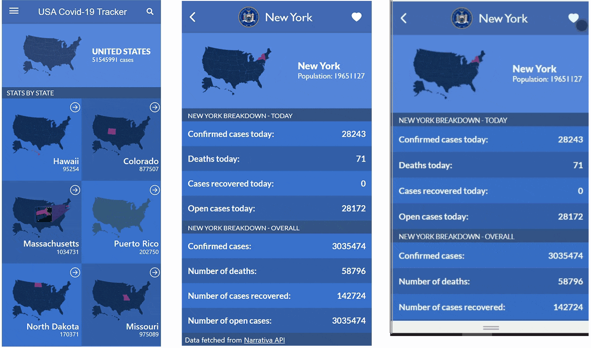

# React.js USA Covid-19 Tracker

> This application allows the public to keep track of the stadistics of the Covid-19 Pandemic in the United Stated. You will be able to have favorite states to find them more easily using the 🔍 search filter.   

 

More Screenshots

 

## 📋 Search Filter

 

_Quality of screenshots is lower than the actual APP_

## Live Link & Video

[Live Link: Netlify](https://61c4e6811a10602f7bb6d5f6--adoring-beaver-1b59eb.netlify.app/)

[Explanation Video](https://drive.google.com/file/d/1Vi0aTf7nqCofh6dNBYaVjJAwL7sCM3mg/view?usp=sharing)

## Built With

- React js
- Redux
- [Covid-19 API](https://documenter.getpostman.com/view/10831675/SzYZ1eNY#bb5931aa-52c3-4000-ba41-6ed9209556e1)
- [Civil Service USA](https://github.com/CivilServiceUSA/us-states)
- Ant Design
- React-icons
- Linters: Stylelint and Eslint

## Getting Started

To get a local copy up and running follow these simple example steps.

### Prerequisites

- Node js installed
- Visual Studio Code (or any other code editor)
- Terminal
- Browser of your preference

### Setup

- git clone https://github.com/RafaelEchart/React-USA-Covid19Tracker.git
- cd React-USA-Covid19Tracker

### Install

Inside of your directory run the following commands:

- npm install 
- npm run start

### Usage

- After ther 'npm run install' the browser will open with the React.js app

### Run tests

- Check that all the tests are correctly passed🤝

### Merge

- Merge it with your main branch so we can all see your work!!🤝

## Author

👤 **Rafael Echart**

- GitHub: [@rafaelechart](https://github.com/rafaelechart)
- Twitter: [@rafaechart](https://twitter.com/rafaechart)

## 🤝 Contributing

Contributions, issues, and feature requests are welcome!

## Show your support

Give a ⭐️ if you like this project!

## Acknowledgments

- Rafael Echart
- Microverse documentation ⭐️

## 📝 License

This project is [MIT](./MIT.md) licensed.